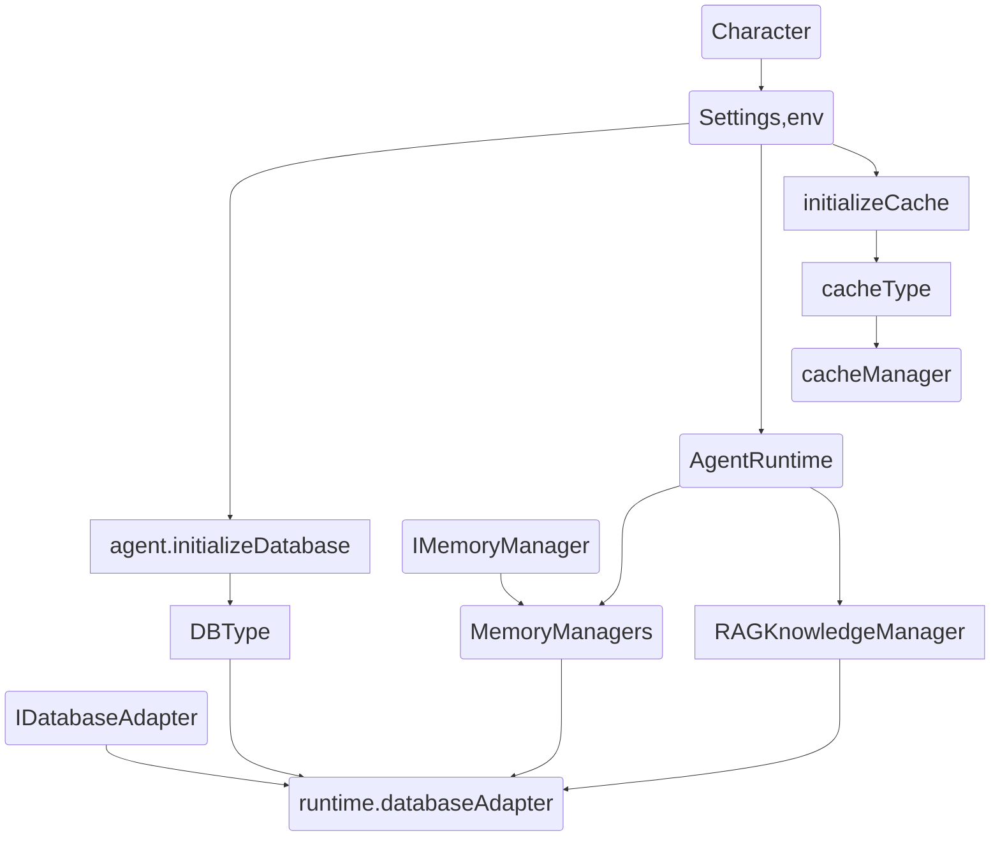
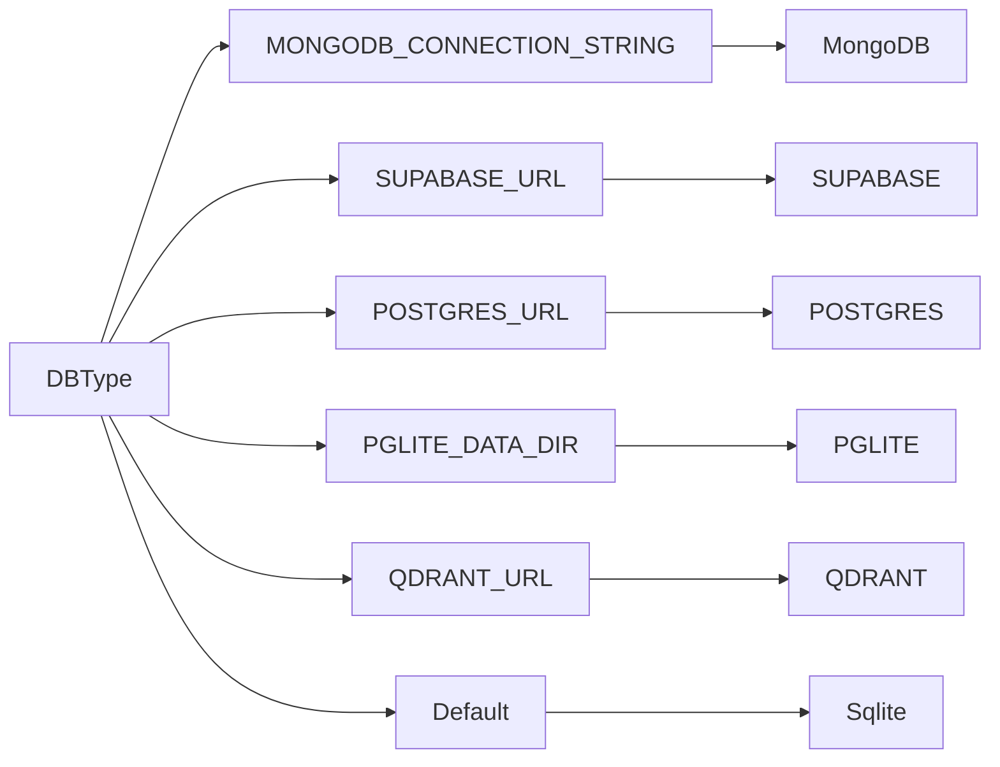

# Eliza knowlege & memory

Tags: 706creators, eliza
Date: February 12, 2025 → February 14, 2025

## eliza 中的存储结构





## cache :

eliza 中存在一个缓存管理器  ICacheManager。

 接口比较简单 ，只有  **get , set , delete** 。

CacheStore 分为三种： **redis 、database、filesystem** 。 

cacheManager 真实类型对应了  各种 CacheAdapter，绝对存储位置

基础的  CacheManager 类 分三种：

1. MemoryCacheAdapter
2. FsCacheAdapter
3. DbCacheAdapter

默认使用 database 存储，默认存储在 database 中。

## database:

agent 中定义了一个 通用的 database 。

支持两种db :

1. 一种 sqlite 默认，
2. 一种 postgres 。 根据  POSTGRES_URL 的定义来标识
3. 其他

db  作为数据持久层。 cache 依赖 database 

## knowlege  相关概念

每个 知识碎片都会被解析成一个字符串，通过 uuid 生成算法，生成 唯一的 id 。
在写入之前，会在 documentsManager 中 通过 知识碎片的 id 检查一遍，是否存在，如果之前处理过了，就跳过。

知识碎片处理模块:  **src/core/knowlege.ts**  主入口: set 方法。

### 写入 知识碎片分两步：(知识碎皮写入之前会按照 trunk_size 拆成 更小的碎片。)

1.  一步是文档  documentManager 这里的 embedding 是 0 也就是 空数据。
2. 真实的 知识碎片，包含了向量数据的 在  knowledgeManager 中。

知识碎片标识 :   **agentId , roomId , userId** 

后续可以根据上下文 获取对应范围的知识碎片。 

**memoryManagers**  是 agent 中的所有的 记忆 管理器，

包含组件类型:

1.  messageManager 
2. descriptionManager
3. loreManager
4. documentsManager  documentManager 包含了 知识原始数据。 
5. knowledgeManager 

同时 agent 本身保留了 opt.managers 的扩展接口，如果需要，可以对内设置自己的 记忆管理器。

专门的 rag 知识管理器： **ragKnowledgeManager** 是 RAGKnowledgeManager 

**knowledge 存储的下层是 Memory , 这是 Eliza 中容易混淆的两个概念。** 

### memory 的基本单位:

```tsx
export interface Memory {
    /** Optional unique identifier */
    id?: UUID;
    /** Associated user ID */
    userId: UUID;
    /** Associated agent ID */
    agentId: UUID;
    /** Optional creation timestamp */
    createdAt?: number;
    /** Memory content */
    content: Content;
    /** Optional embedding vector */
    embedding?: number[];
    /** Associated room ID */
    roomId: UUID;
    /** Whether memory is unique */
    unique?: boolean;
    /** Embedding similarity score */
    similarity?: number;
}
```

- 时间长了以后 慢的原因：
searchMemories adapter-sqlite 中 searchMemories 会把数据所有的向量距离计算出来。 都在一个表中， 按照 类型（表名来区分），然后计算向量和，取 top n

## 使用举例

拿 direct-client 中的使用举例：

### memory 写入:

```markdown
const responseMessage: Memory = {
    id: stringToUuid(messageId + "-" + runtime.agentId),
    ...userMessage,
    userId: runtime.agentId,
    content: response,
    embedding: getEmbeddingZeroVector(),
    createdAt: Date.now(),
};

await runtime.messageManager.createMemory(responseMessage);
```

### memory 读取:

最近聊天记录读取: 

```markdown
const [actorsData, recentMessagesData, goalsData]: [
    Actor[],
    Memory[],
    Goal[],
] = await Promise.all([
    getActorDetails({ runtime: this, roomId }),
    this.messageManager.getMemories({
        roomId,
        count: conversationLength,
        unique: false,
    }),
    getGoals({
        runtime: this,
        count: 10,
        onlyInProgress: false,
        roomId,
    }),
]);
```

## knowlege 获取:

从 knowledgeManager 或者 ragKnowledgeManager 获取

```markdown
  let knowledgeData = [];
  let formattedKnowledge = "";

  if (this.character.settings?.ragKnowledge) {
      const recentContext = recentMessagesData
          .slice(-3) // Last 3 messages
          .map((msg) => msg.content.text)
          .join(" ");

      knowledgeData = await this.ragKnowledgeManager.getKnowledge({
          query: message.content.text,
          conversationContext: recentContext,
          limit: 5,
      });

      formattedKnowledge = formatKnowledge(knowledgeData);
  } else {
      knowledgeData = await knowledge.get(this, message);
      formattedKnowledge = formatKnowledge(knowledgeData);
  }
```

默认  ragKnowledge = false 

- 使用 knowledgeManager  runtime.knowledgeManager.searchMemoriesByEmbedding

启用 ragKnowledge 后：

- 调用 专门的 rag 资源 ragKnowledgeManager 搜索

knowledgeManager 是一个 和 memmory 存储相似的结构。

knowlege 和 memorry 的区别在于， memorry 主要存储和房间相关的信息，而 knowledge 主要存储更通用的信息。 

## knowledge 写入:

参看 :  knowledge.set 方法写入

```tsx

async function set(
  runtime: AgentRuntime,
  item: KnowledgeItem,
  chunkSize = 512,
  bleed = 20
) {
  await runtime.documentsManager.createMemory({
      id: item.id,
      agentId: runtime.agentId,
      roomId: runtime.agentId,
      userId: runtime.agentId,
      createdAt: Date.now(),
      content: item.content,
      embedding: getEmbeddingZeroVector(),
  });

  const preprocessed = preprocess(item.content.text);
  const fragments = await splitChunks(preprocessed, chunkSize, bleed);

  for (const fragment of fragments) {
      const embedding = await embed(runtime, fragment);
      await runtime.knowledgeManager.createMemory({
          // We namespace the knowledge base uuid to avoid id
          // collision with the document above.
          id: stringToUuid(item.id + fragment),
          roomId: runtime.agentId,
          agentId: runtime.agentId,
          userId: runtime.agentId,
          createdAt: Date.now(),
          content: {
              source: item.id,
              text: fragment,
          },
          embedding,
      });
  }
}
```

### 

如果启用了 **ragKnowledge** 那么调用: 

runtime.ragKnowledgeManager 的方法写入

- createKnowledge
- processFile

获取 embed 数据: 

```tsx
import { embed, getEmbeddingZeroVector } from "….core/embedding.ts";
const embedding = await embed(runtime, processed);
```


###  视频教程

[](https://www.youtube.com/watch?v=X16xm_3vPM4)
