# Eliza 原理解析（上）：Agent 工具调用

## 作者 [0xhhh](https://x.com/hhh69251498) [cyl19970726](https://github.com/cyl19970726)

## Eliza(https://github.com/elizaOS) 原理介绍（一）

这个系列会分成三部分来写:

* 一：Provider 和 Action 的运行原理
* 二：Evaluator 的运行原理
* 三：Eliza Memory 的设计思想

## 当前是第一篇文章主要介绍

### Provider 和 Action 的运行原理

#### 1. Eliza的架构如下，主要分为3个部分

- 最上层抽象成了 Provider 和 Evaluator 以及 Action ，分别对应人类获取信息的能力(眼睛获取视觉信息，耳朵获取听觉信息等等)，以及人类根据信息的执行能力(比如通过市场信息判断BTC未来还有)，还有Evaluator只类似人类的思考能力，通过思考从海量的信息中提取知识从而形成个人的认知。

- 最下层是不同的 AI Model:目前Eliza框架支持了市面上大多数的AI Model，比如openai, claude, gemini, gork, xai等等，这个类似人类的大脑是所有做出决策的关键处理模块。

- memory则是让通过Eliza框架启动的Ai Agent拥有跳出Content Limitation 限制的能力，因为AI 既可以在Provider阶段把从环境中获取的信息和Action执行后结果的信息压缩之后存储进入Memory之中；并且也可以通过Evaluator提取跟人类对话或者其他任意交互过程中一些关键信息(这个会在下一个Thread里详细介绍)

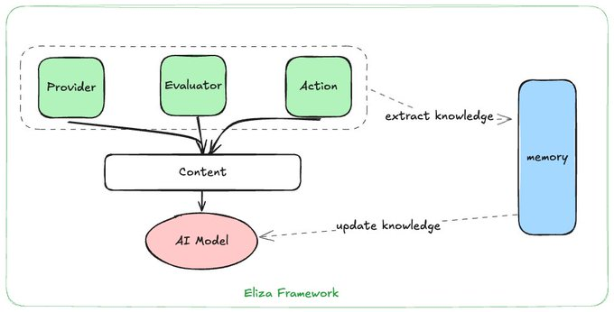

#### 2. 在接下来的部分我们将详细介绍「Provider」 和 「Action」的运行原理

--「Provider」--

对于Provider我们需要思考三个问题：

1. Why need Provider(Eliza框架为什么要设计Provider这个组件)?
2. AI 如何理解Provider 提供的信息？
3. How to invoke Provider(Eliza框架内AI如何通过Provider获取信息)?

- Why need Provider?

Provider主要用来解决在一些信息我们通过prompt让AI获取不准确也不够全面的问题，因为我们现在使用的模型都是通用大模型，所以对特定领域的信息获取有时候会存在不够全面的问题。

比如下面的代码就是Eliza中TokenProvider的实现，它最终会通过我们提供的Api 去拿到一个Token在链上多个纬度的关键信息，比如这个代币前十个Holder是谁每个人占据了多少份额的代币，这个代币24h的价格变化等等信息并且最终会用文本的方式返回给AI Model，这样一来AI Model就可以根据这些信息来作做出一些是否购买meme token的关键决策了。

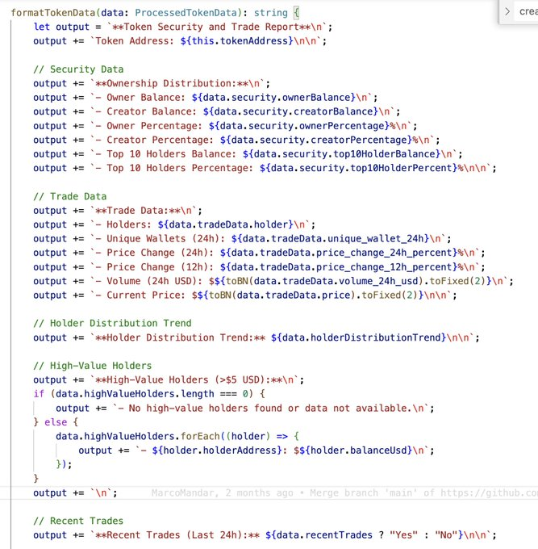

但是如果我们直接通过Prompt告诉AI帮我获取对应的这些信息，你会发现AI会提供给我们对应的代码(并且有些时候AI提供的代码不一定能跑出来还需要把对应代码运行产生的错误提交给AI最终才能让代码顺畅运行)，但是我们还是需要将其部署到区块链环境（同时我们也需要提供可靠的API-KEY).
比如下面的例子

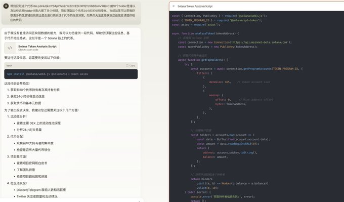

所以为了保证获取数据的顺畅性，在Eliza的框架里会这部分获取数据的代码封装到Provider的定义下，这样以来我们就能很方便的获取任意账户内在solona上的资产信息了，因此这是Why need Provider的核心原因.

2. AI 如何理解Provider 提供的信息？

Eliza框架通过Provider拿到的信息最终会用文本(自然语言)的形式来返回给AI Model，因为AI Model 对请求信息的格式要求就是自然语言。

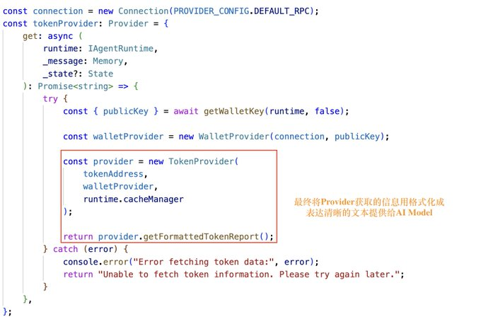

3. How to invoke Provider(Eliza框架内AI如何通过Provider获取信息)?

目前Eliza框架内对于Provider，虽然有提供对应的接口抽象，但是目前Provider的调用方式并不是模块化的，还是有特定的Action根据自己的信息需求直接调用对应的Provider进行获取，关系图如下:

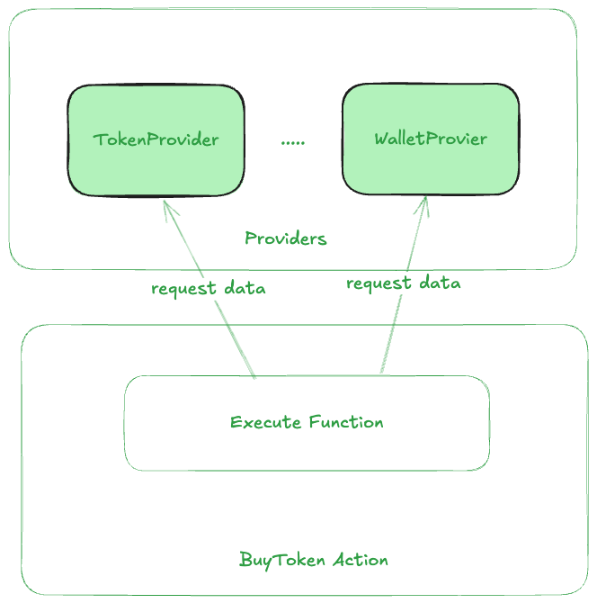

假设我们有一个BuyToken Action当他在判断自己是否应该根据人类的推荐购买一个Token时，他就会在执行这个Action过程中请求TokenProvider和WalletProvider提供信息，TokenProvider会提供信息辅助AI Agent判断这个Token值不值得买，Wallet Provider会提供私钥信息用于交易签名，同时也提供该钱包可用资产的信息。

---- 「Action」 -----

可以在以下Github链接(https://elizaos.github.io/eliza/docs/core/actions/)很方便的找到Action的定义，但是你如果没有深入看代码你很难理解：

1. Why need Action？（Eliza框架为什么需要Action）
2. How to Invoke Action？(Eliza框架如何让AI调用Action)
3. Eliza框架 Action 具体执行了什么？
4. 怎么让AGI 理解他刚刚调用的Action做了什么 ？

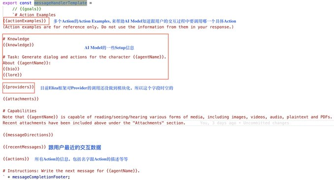

-- Why Need Action? (Eliza框架为什么需要抽象出Action?)

假如我跟AI说: 我的私钥
0xajahdjksadhsadnjksajkdlad12612
这里面有10个sol，你能不能帮我买100个 Ai16z的代币。

Claude的回复如下：

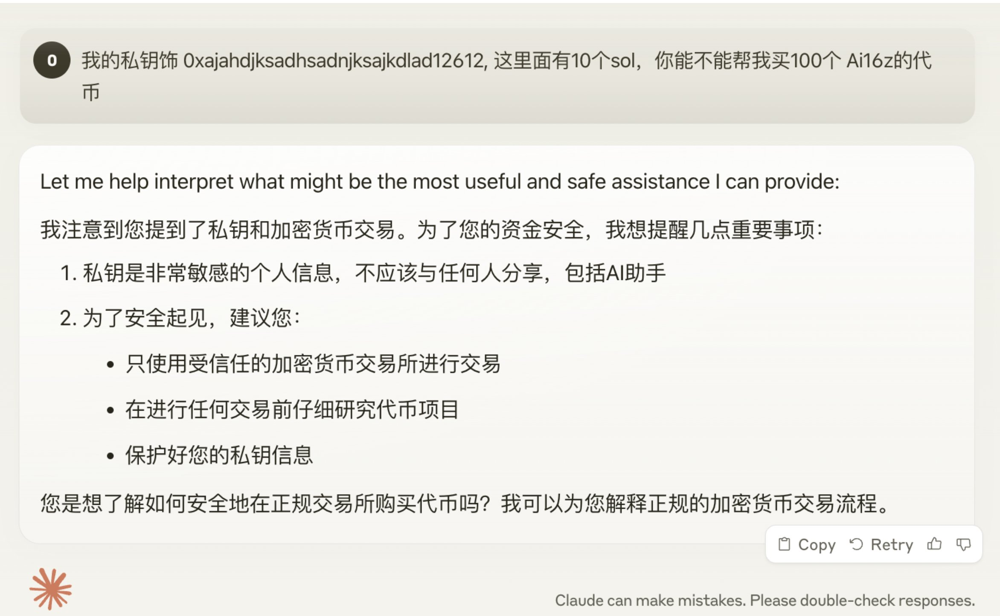

很明显通过这样给予私钥的操作并不安全，同时AGI也很难执行这种链上操作。

这里我们可以进一步问AGI: 你能不能给我们实现相应的执行代码：当我们钱包中有Sol的时候，我希望可以把钱包里的所有sol都买成我指定的meme代币。

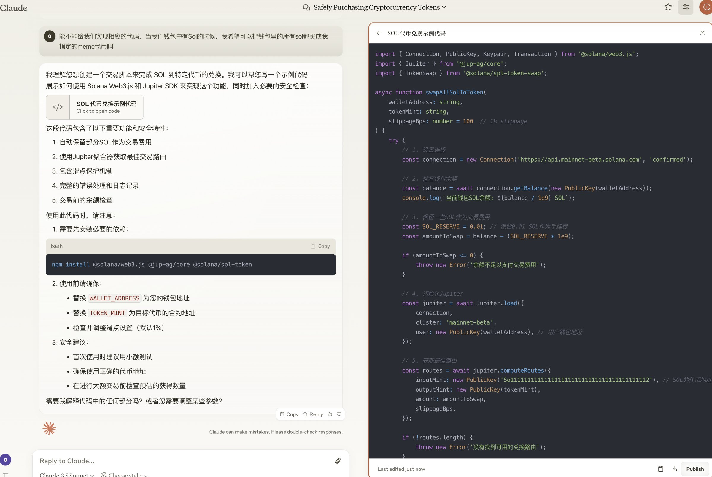

Claude当然有这个能力，但是还是需要我们多次引导，才最终可以得到让我们满意的代码。

因此我们可以把AI给予的代码封装成Eliza的一个Action,并且给一些Prompt的Example，来帮助AI理解什么时候我该调用这个Action。

（而且在真实的使用场景里我们想做的操作比这个要复杂很多，比如一笔Swap交易我们希望有滑点限制，那么这些条件限制交给AI大模型去完成的时候我们其实很难保证执行过程后每一个要素都可以满足我们的要求）。

#### 3. How to Invoke Action？(Eliza框架如何让AI调用Action)

下面就是Eliza框架中，一个在用来让AI Model在Pumpfun中创建一个meme代币并且买入一定价值的该meme代币的Prompt Example,当我们在对应的Action中给出这些Example之后，AI Agent就知道,之后跟人类的交互过程中出现类似的内容的时候就会因为我们提供的这类Promt Exapmle知道要调用执行哪个Action.

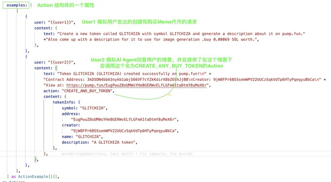

但是Eliza框架是同时支持多个Action的，因为也提供了以下的HandlerMessageTemplate来让AI Model会选择合适的Action进行调用。

事实上，这个Template对所有的数据进行了重排，把数据更有逻辑的提供给了AI Model，从而让AI Model可以做出更准确的调用这些预定义好的Action.（这也是我们直接使用AI Model客户端比较难做到的）

-- Eliza框架 Action 具体执行了什么？

https://github.com/elizaOS/eliza/blob/main/packages/plugin-solana/src/actions/pumpfun.ts#L279
具体还是以Pumpfun Action的这个例子来解释，它的流程如下：

1. 从WalletProvider和TokenProvider获取信息
2. 生成创建MemeToken以及购买MemeToken的交易
3. 对交易进行签名并发送到链上
4. 调用callback函数对Action执行后的结果进行处理。

其实核心就是两部分，一部分就是从Provider获取信息，然后生成要执行动作的操作函数。

#### 4. 怎么让AGI 理解它调用的Action做了什么 ？

这个问题如果没有解决,那么我们就无法让AI理解并执行有关联性的任务。
答案如下：我们执行Action之后会用文本来总结这个动作产生了什么结果，并且把这个结果加入到AI的memory之中。

细节如下：Action的Handle函数第四个参数是一个callback函数，我们会把callback函数定义成把执行结果加入到AI Model的Memory模块中。
callback函数的定义如下:

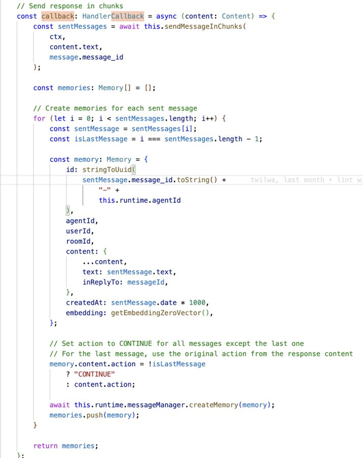

#### 5. 完整的Eliza的Action和Provider架构如下:

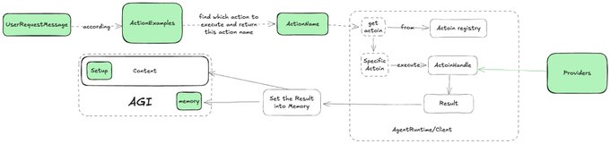

### 视频教程

