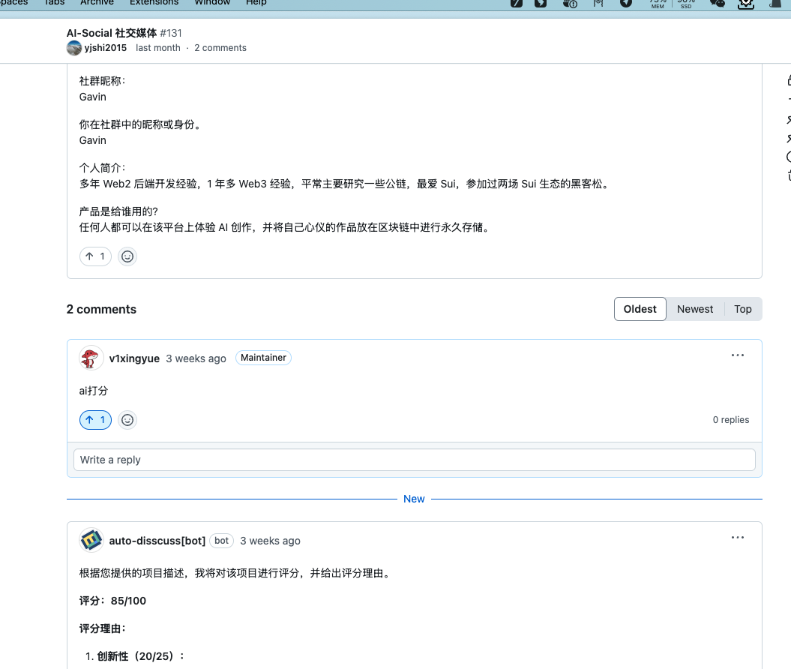
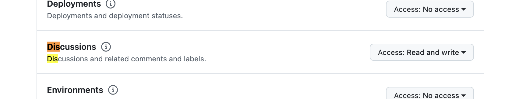
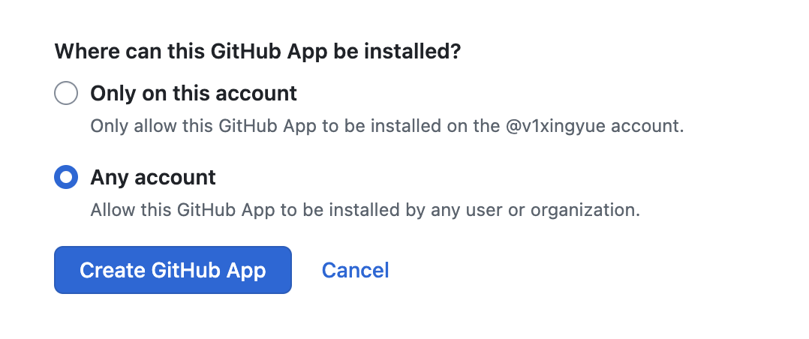
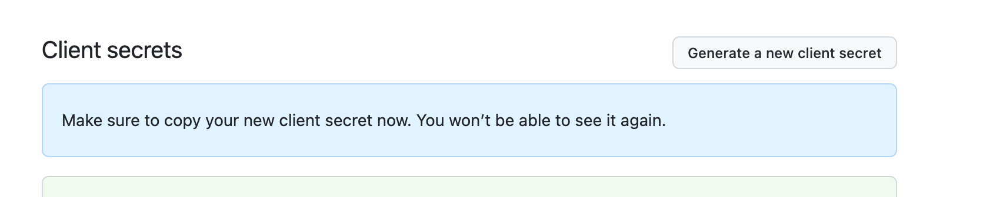
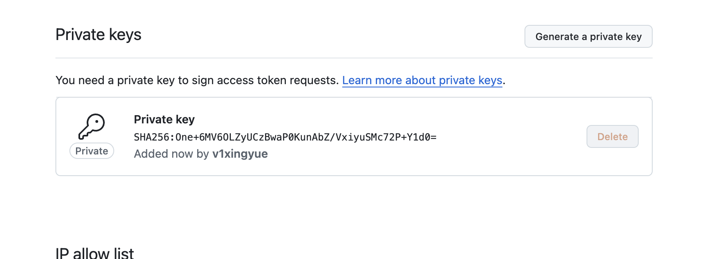
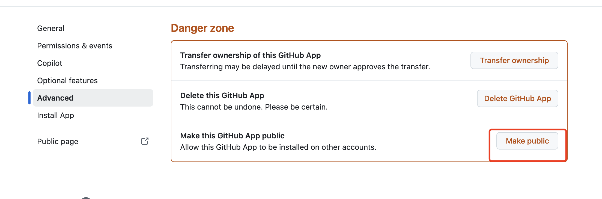

# 你的第一个 GitHub 讨论机器人

## 1.1 简介



讨论机器人是通过Github 的 APP来完成的，潜伏在 安装了 APP 的 Disscussion中，根据指定的关键词，触发 AI 的回复。

## 1.2 LLM API 简介和调用

大多数的 LLM 都通过类似 `OpenAI` 的 API 来完成，一个示例操作命名如下：

```bash
curl https://api.deepseek.com/chat/completions \
  -H "Content-Type: application/json" \
  -H "Authorization: Bearer sk-" \
  -d '{
        "model": "deepseek-chat",
        "messages": [
          {"role": "system", "content": "You are a helpful assistant."},
          {"role": "user", "content": "Hello!"}
        ],
        "stream": false
      }'
```

- OPENAI_API_KEY 为 模型提供商的 API KEY，用来做身份识别
- model 为 你这次交互需要使用的模型名称，根据模型提供商的模型列表来选择
- messages 为 你这次交互的上下文，包括你和 AI 的对话 ，如果有多重会话，那么分别嵌入即可。
- stream 为 是否开启流式输出，如果为 true，那么模型提供商的 API 会返回一个流式的响应，如果为 false，那么模型提供商的 API 会返回一个 JSON 格式的响应。

不同的模型提供商，还可能有一些额外的参数，比如 `temperature` 等，这些参数的含义和用法，可以参考模型提供商的文档。

发完请求后，模型提供商的 API 会返回一个 JSON 格式的响应，其中包含你这次交互的回复。
返回实例如下:

```json
{
  "id": "f02da291-6b61-419d-8c53-13595c91075e",
  "object": "chat.completion",
  "created": 1736557435,
  "model": "deepseek-chat",
  "choices": [
    {
      "index": 0,
      "message": {
        "role": "assistant",
        "content": "Hello! How can I assist you today? 😊"
      },
      "logprobs": null,
      "finish_reason": "stop"
    }
  ],
  "usage": {
    "prompt_tokens": 11,
    "completion_tokens": 11,
    "total_tokens": 22,
    "prompt_cache_hit_tokens": 0,
    "prompt_cache_miss_tokens": 11
  },
  "system_fingerprint": "fp_3a5770e1b4"
}⏎                                                                                                                 
```

其中, `choices` 为 模型返回的回复，`content` 为 回复的内容,也是 你这次交互的回复。


## 1.3 Github APP 创建和相关权限

通过 创建 Github APP [https://github.com/settings/apps/new](https://github.com/settings/apps/new)。

这里需要注意权限,选择 `Repository permissions` 下的 `Discussions` 的 `Read and write` 权限。


最下边的安装权限，需要设置为允许任何账户。


创建完成后，在 `Settings` 中，生成 `Secrets` 和 秘钥对。




生成秘钥对后，会下载一个私钥文件，这个文件需要妥善保存到本地。

如果需要安装到 Org 中，所以，需要选择 Public。


设置完成后，在 左侧的 `Install App`  中选择你需要安装的组织即可。

## 1.4 Github API 轮询 `Discussions`

## 1.5 自动触发 `LLM` 回复

## 1.6 实例代码

https://github.com/CreatorsDAO/auto-disscuss